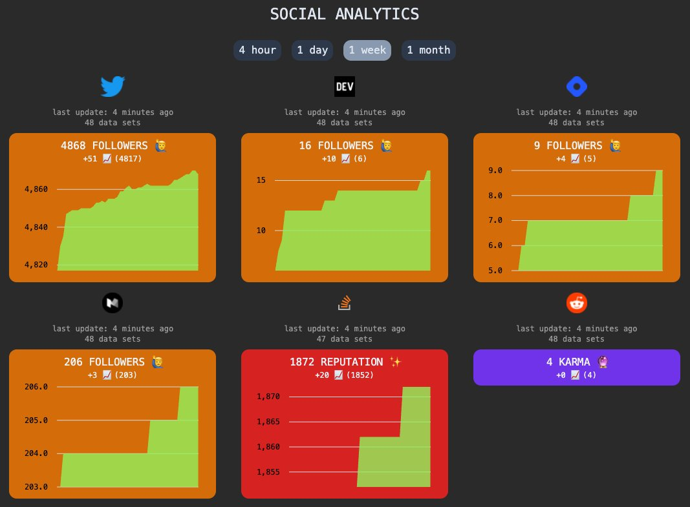

# A Lambda-Powered Social Media Dashboard

* **Angular**: the frontend application (=> [./app](app))
* **Terraform**: to create our infrastructure (=> [./infra](infra))

## Preconditions

* [tfenv](https://github.com/tfutils/tfenv): to install Terraform in the needed version (=> `terraform_version`)
* exported credentials for your AWS account
* define configuration via `configuration.json` (create a copy of the [example file](.configuration.json) and remove the leading dot)
  * If you don't have a certificate in ACM or just don't want to use an own domain, leave `terraform_domain` empty.

## How to

Run `./go.sh go` 🎉

## Other commands

* `./go.sh bootstrap-tf` creates the state bucket & lock table if it's not already created
* `./go.sh apply-tf` apply Terraform to create infrastructure
* `./go.sh rollout` build and deploy the frontend application